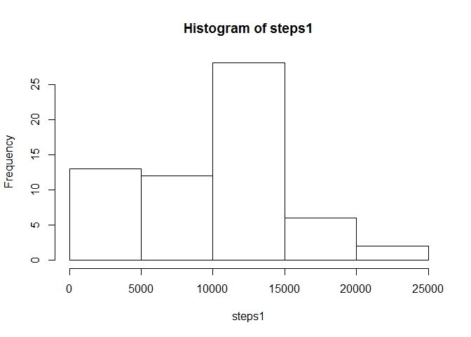
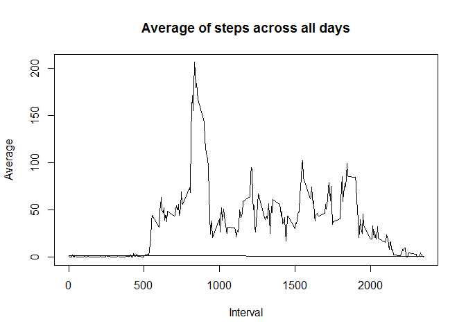
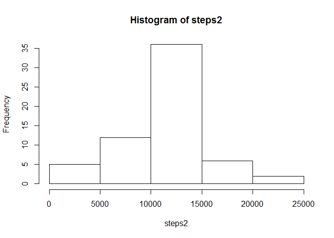
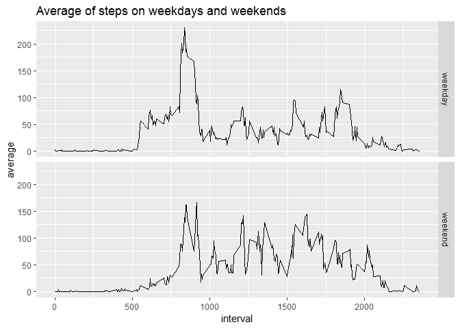

## Loading and preprocessing the data
- Code for reading in the dataset and processing the data:

```r
# Setting up options
knitr::opts_chunk$set(message = F, warning = F, comment = F)
# To unzip the activities file execute the following code
# library(utils);unzip("activity.zip")
activity <- read.csv("activity.csv")
activity$date <- as.Date(activity$date)
```


## What is mean total number of steps taken per day?
- Histogram of the total number of steps taken each day:

```r
library(dplyr)
steps1 <- {activity %>% group_by(date) %>% 
            mutate(steps=sum(steps, na.rm = T))}$steps
steps1 <- steps1[activity$interval == 0]
hist(steps1)
```

<!-- -->

- Mean and median number of steps taken each day:

```r
mean(steps1)
```

```
FALSE [1] 9354.23
```

```r
median(steps1)
```

```
FALSE [1] 10395
```


## What is the average daily activity pattern?
- Time series plot of the average number of steps taken:

```r
activity <- activity %>% group_by(interval) %>% 
      mutate(avsteps = mean(steps, na.rm = T))
plot(activity$interval, activity$avsteps, type = "l", xlab = "Interval", ylab = "Average",
     main = "Average of steps across all days")
```

<!-- -->

- The 5-minute interval that, on average, contains the maximum number of steps

```r
activity$interval[which.max(activity$avsteps)]
```

```
FALSE [1] 835
```


## Imputing missing values
- Code to describe and show a strategy for imputing missing data:

1.  Total number of missing values in the dataset

```r
sum(is.na(activity$steps))
```

```
FALSE [1] 2304
```

2. Strategy for filling in all of the missing values
3. Create a new dataset that is equal to the original dataset but with the missing data filled in

```r
# Filling missing values with average for that interval across all days
activity$steps[is.na(activity$steps)] <- activity$avsteps[is.na(activity$steps)]
```

4. Histogram of the total number of steps taken each day after missing values are imputed

```r
steps2 <- {activity %>% group_by(date) %>% 
            mutate(steps=sum(steps, na.rm = T))}$steps
steps2 <- steps2[activity$interval == 0]
hist(steps2)
```

<!-- -->

Mean and median number of steps taken each day (note the difference with the same estimates before imputation of missing values):

```r
mean(steps2)
```

```
FALSE [1] 10766.19
```

```r
median(steps2)
```

```
FALSE [1] 10766.19
```

Difference in estimates of the total daily number of steps after missing values are imputed: 

```r
d <- sum(steps2) - sum(steps1); d
```

```
FALSE [1] 86129.51
```

Percent increment that such a variation represent:

```r
d/sum(steps1)*100
```

```
FALSE [1] 15.09434
```


## Are there differences in activity patterns between weekdays and weekends?

1. Create a new factor variable in the dataset with two levels -- "weekday" and "weekend" indicating whether a given date is a weekday or weekend day:

```r
saturday <- weekdays(as.Date("2018-10-6"))
sunday <- weekdays(as.Date("2018-10-7"))
activity$wday <- as.factor(as.character((lapply(activity$date, function(day) {
      if(sum(c(saturday, sunday) %in% weekdays(day))) "weekend"
      else "weekday"
}))))
```

2. Panel plot containing a time series plot of the 5-minute interval (x-axis) and the average number of steps

```r
library(ggplot2)
activity <- activity %>% group_by(interval, wday) %>% 
      mutate(avstepsByWeekday = mean(steps, na.rm = T))
qplot(interval, avstepsByWeekday, data = activity, facets = wday~., geom = "line",
      main = "Average of steps on weekdays and weekends", ylab = "average")
```

<!-- -->

Note


